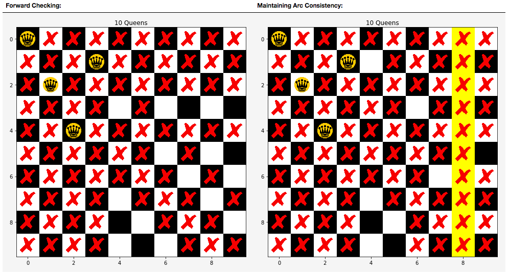

# Constraint-Satisfaction-Notebook
Example lecture for **Constraint Satisfaction Problems** (CSP) in an interactive jupyter notebook.
We present multiple algorithms to solve CSPs and we explain the inner workings of these algorithms.
For example, we show how to solve NQueens problem using backtracking with forward checking or with Maintaining Arc Consistency algorithm.




# CONTENTS

 1. [**Introduction to Constraint Propagation Problems (L13 & L14)**](#Intro):
    1. *Definition*
    2. *Examples*

 2. [**Solving CSPs (L14 & L 15)**](#Constraint_Propagation):
    1. *Constraint Propagation in CSPs*:
        1. Propagation:
            1. [AC-1](#ac1):
                * Definition
                * Example: solving Sudoku with AC-1
            2. [AC-3](#ac3):
                * Definition
                * Example: solving Sudoku with AC-3
    2. *[Search in CSPs](#search_in_csps)*:
        1. [Generic Search](#generic_search):
            * Formulating CSPs as a state space search problem
            * Complexity
            * Example: NQueens with generic search (5 Queens)
        2. [Backtracking Search (BT)](#backtracking):
            * Definition
            * Complexity
            * Example: solving NQueens (15 Queens)
        3. [Backtracking Search with Forward Checking (BT-FC)](#backtracking_w_fc):
            * Definition
            * Complexity
            * Example: solving NQueens (20 Queens)              
        4. [Backtracking while Maintaining Arc Consistency (BT-MAC)](#backtracking_w_mac):
            * Definition
            * Complexity
            * Example: solving NQueens (20 Queens)
        4. BT-DC with Dynamic Variable Ordering:
            * Definition
            * Complexity
            * Example: solving NQueens (1000 Queens)

    3. *Elimination for Constraints in CSPs*:
        1. Variable Elimination for Constraints:
            * Definition: join and project
            * Example
        2. Bucket elimination (Adaptive Consistency):
            * Definition
            * Example

 3. **Appendix**:
    1. Constraint Optimization Problem:
        1. Branch-and-Bound
        2. Example: using Map Coloring problem with cost added to the colors to use.
    2. Incremental Repair / Iterative Repair / Min-Conflict Heuristic
        * Definition
        * Example

## Installation
Heavily recommended to use a virtual environment to use this setup.
You can do that by for example using virtualenv and virtualenvwrapper.

Install pip:

If in Mac, do (assuming you installed brew, which you should...):
```
brew install pip
```

If in Linux:
```
sudo apt-get install pip
```

Install virtualenv:
```
pip install virtualenv
```

Install virtualenvwrapper:
```
pip install virtualenvwrapper
```

Now, let's clone this repo and install the necessary requirements.
```
git clone git@github.com:ToniRV/Constraint-Satisfaction-Notebook.git csp_notebook
```
Or if you don't want to use SSH or you don't have it setup:
```
git clone https://github.com/ToniRV/Constraint-Satisfaction-Notebook.git csp_notebook
```

Let us build the virtual environment for python, we will need to have python3 installed (which I assume you have in `/usr/local/bin/python3` but it could be somewhere else! Make sure you specify the correct path in the following command:
```
cd csp_notebook
mkvirtualenv csp_notebook --python=/usr/local/bin/python3 -r requirements.txt
```

Finally, activate your virtual environment:
```
workon csp_notebook
```

You are ready to go!
```
jupyter notebook CSPs.ipynb
```
Enjoy!
